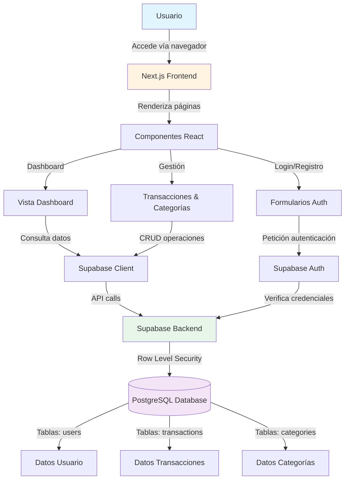

# Informe Técnico de Arquitectura
**BudgetView MoneySaver**

Este documento describe la arquitectura técnica, las tecnologías seleccionadas y la justificación de dichas elecciones para el desarrollo de la aplicación.

---

## 1. Stack Tecnológico

La aplicación ha sido construida utilizando un conjunto de tecnologías modernas y robustas, enfocadas en el rendimiento, la escalabilidad y la experiencia de desarrollo.

*   **Lenguaje de Programación:** [TypeScript](https://www.typescriptlang.org/)
    *   Un superconjunto de JavaScript que añade tipado estático, mejorando la calidad del código y reduciendo errores en tiempo de ejecución.
*   **Framework Frontend/Fullstack:** [Next.js](https://nextjs.org/) (Versión 16)
    *   Utilizando **React** como librería de interfaz de usuario.
    *   Empleando **App Router** para una gestión de rutas moderna y eficiente.
*   **Estilos y Diseño:** [Tailwind CSS](https://tailwindcss.com/)
    *   Framework de utilidades CSS para un diseño rápido, responsivo y mantenible.
    *   Componentes UI basados en **Radix UI** (vía shadcn/ui) para accesibilidad y personalización.
*   **Base de Datos y Autenticación:** [Supabase](https://supabase.com/)
    *   Plataforma Backend-as-a-Service (BaaS) basada en **PostgreSQL**.
    *   Proporciona autenticación segura, base de datos en tiempo real y almacenamiento.

---

## 2. Justificación de las Herramientas

La elección de este stack tecnológico responde a las siguientes necesidades del proyecto:

1.  **Next.js & React:**
    *   *Por qué:* Next.js es el estándar actual para aplicaciones React en producción. Ofrece renderizado del lado del servidor (SSR) y generación estática (SSG) por defecto, lo que garantiza una carga inicial rápida y un excelente SEO. Su arquitectura de "App Router" simplifica la gestión de layouts y el fetching de datos.

2.  **TypeScript:**
    *   *Por qué:* En un proyecto financiero, la precisión de los datos es crítica. TypeScript ayuda a prevenir errores comunes (como tratar un número como texto) antes de que el código se ejecute, facilitando el mantenimiento a largo plazo.

3.  **Supabase (PostgreSQL):**
    *   *Por qué:* Elegimos Supabase porque ofrece la potencia de una base de datos SQL relacional (PostgreSQL) con la facilidad de uso de una API moderna. Nos permite gestionar usuarios (Autenticación) y datos sin necesidad de configurar y mantener un servidor backend complejo desde cero, acelerando el tiempo de desarrollo.

4.  **Tailwind CSS:**
    *   *Por qué:* Permite construir interfaces modernas y adaptables a móviles (responsive) sin salir del HTML/JSX. Reduce drásticamente el tamaño de los archivos CSS finales y evita conflictos de nombres de clases.

---

## 3. Diagrama de Arquitectura

El siguiente esquema ilustra cómo interactúan los diferentes componentes del sistema:

### Descripción del Flujo:

**Capa de Presentación (Frontend):**
1.  El **Usuario** accede a la aplicación a través de su navegador web.
2.  **Next.js** maneja el enrutamiento y renderiza los componentes de React.
3.  Los componentes principales incluyen:
    *   Formularios de autenticación (Login/Registro)
    *   Dashboard principal
    *   Gestión de transacciones y categorías

**Capa de Autenticación:**
4.  Los formularios de autenticación se comunican directamente con **Supabase Auth** para validar credenciales.
5.  Supabase gestiona sesiones y tokens JWT de forma segura.

**Capa de Datos:**
6.  Los componentes de la aplicación utilizan el **Supabase Client** para realizar operaciones CRUD (Crear, Leer, Actualizar, Eliminar).
7.  Todas las peticiones pasan por el **Supabase Backend** que aplica políticas de seguridad (Row Level Security - RLS).
8.  Los datos se almacenan en **PostgreSQL** en tablas específicas:
    *   `users`: Información de usuarios
    *   `transactions`: Registros de ingresos y gastos
    *   `categories`: Categorías personalizadas
