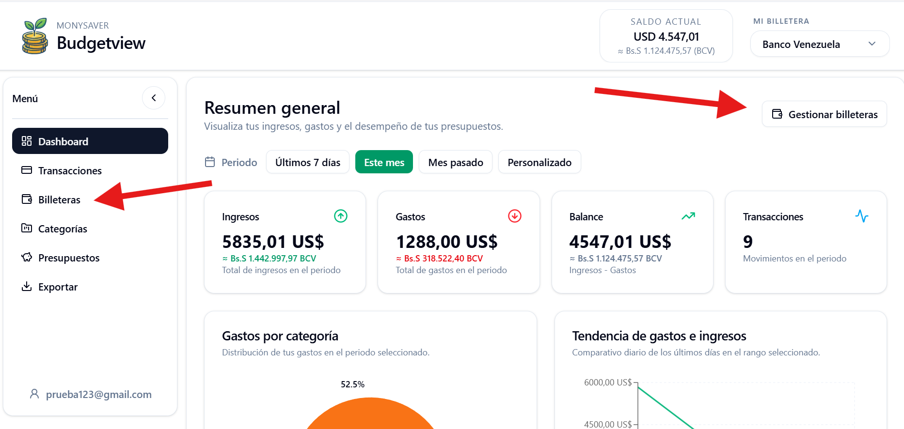
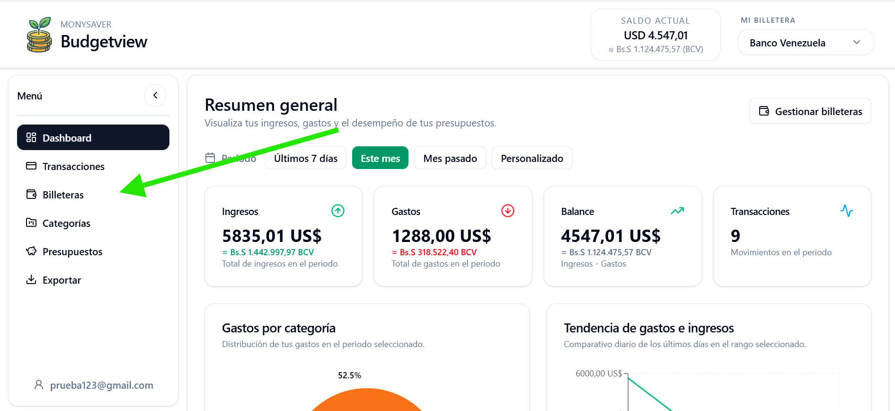
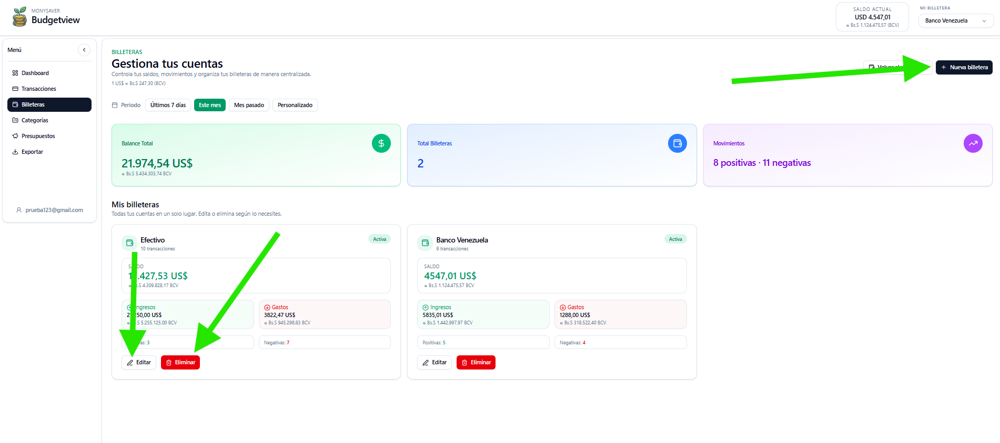
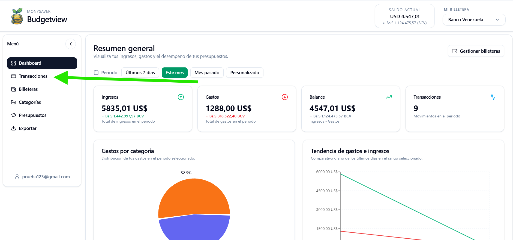
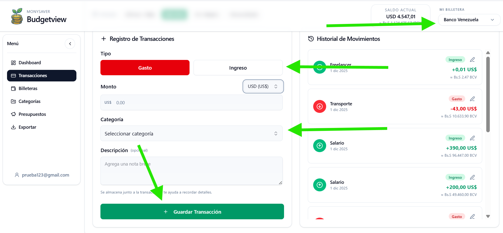
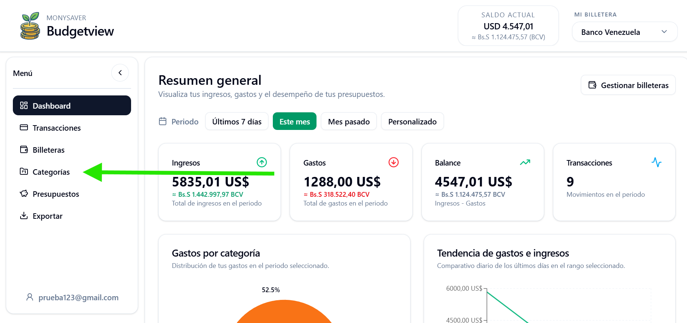
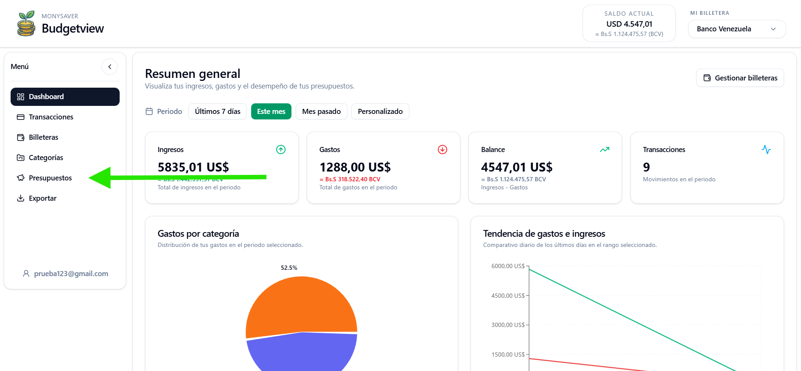
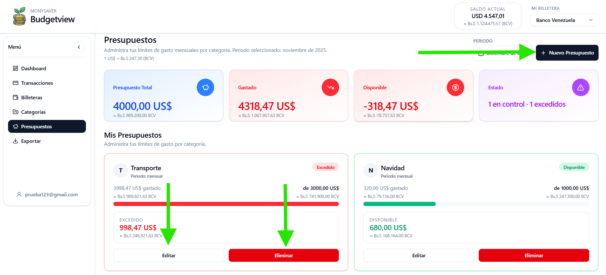
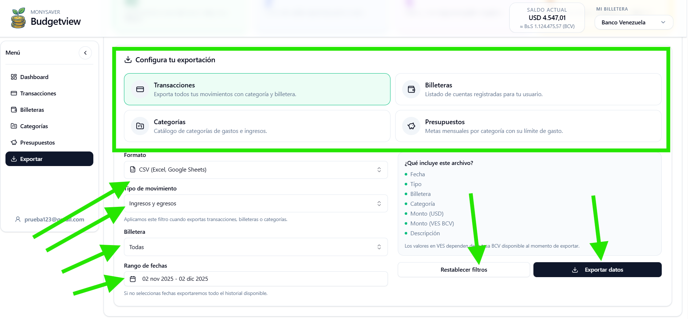

# Manual de Usuario
**BudgetView MoneySaver**

Este documento está diseñado para guiar a los usuarios en el uso de la aplicación BudgetView MoneySaver, explicando paso a paso las funcionalidades principales del sistema de gestión de finanzas personales.

---

## 1. Gestión de Billeteras

### 1.1 ¿Cómo Cambiar Entre Mis Billeteras?

Para cambiar entre sus diferentes billeteras:

1. Acceda a la sección de billeteras en la aplicación.
2. Seleccione la billetera que desea visualizar desde el selector principal.

### 1.2 ¿Cómo Gestionar Mis Billeteras?

**Para agregar una nueva billetera:**

1. Haga clic en el botón **"+"** ubicado en la esquina superior derecha.
2. Complete los datos solicitados
3. Confirme la creación de la billetera.

**Para renombrar o eliminar billeteras:**

1. En el apartado inferior, localice la billetera que desea modificar.
2. Seleccione la opción correspondiente:
    * **Renombrar:** Modifique el nombre y guarde los cambios.
    * **Eliminar:** Confirme la eliminación de la billetera.

---

## 2. Gestión de Transacciones

### 2.1 ¿Cómo Gestionar el Saldo de Mis Billeteras?

Para registrar una nueva transacción, siga estos pasos:

1. **Seleccione la billetera** donde desea registrar la transacción.
2. **Elija el tipo de transacción:**
    * Ingreso
    * Egreso
3. **Ingrese el monto** de la transacción.
4. **Seleccione la categoría** correspondiente.
5. **Agregue una descripción** (opcional pero recomendado para mayor detalle).
6. **Guarde la transacción** haciendo clic en el botón "Guardar".

---

## 3. Gestión de Categorías

### 3.1 ¿Cómo Gestionar Mis Categorías?

**Para agregar una nueva categoría:**

1. Haga clic en el botón **"+"** ubicado en la esquina superior derecha.
2. Ingrese el nombre de la categoría.
3. Seleccione el tipo de categoría:
    * Ingreso
    * Egreso
4. Confirme la creación.

**Para modificar o eliminar categorías:**

1. Localice la categoría que desea modificar.
2. Haga clic en el **menú de tres puntos** (⋮) en la esquina superior derecha de la tarjeta de categoría.
3. Seleccione la acción deseada:
    * **Renombrar:** Cambie el nombre de la categoría.
    * **Cambiar tipo:** Modifique si es categoría de ingreso o egreso.
    * **Eliminar:** Elimine la categoría del sistema.

---

## 4. Gestión de Presupuestos

### 4.1 ¿Cómo Gestionar Mis Presupuestos?

**Para crear un nuevo presupuesto:**

1. Haga clic en el botón **"+"** ubicado en la esquina superior derecha.
2. Complete la siguiente información:
    * **Categoría:** Seleccione a qué tipo de categoría pertenece el presupuesto.
    * **Monto límite:** Establezca el límite de gasto para este presupuesto.
    * **Fecha de vencimiento:** Defina el período de validez del presupuesto.
3. Confirme la creación del presupuesto.

**Para editar o eliminar presupuestos:**

* **Editar:** Haga clic en el botón "Editar" para modificar la categoría, el monto límite o el período del presupuesto.
* **Eliminar:** Haga clic en el botón "Eliminar" para quitar el presupuesto del sistema.

---

## 5. Exportación de Datos

### 5.1 ¿Cómo Exportar Mis Datos?

Para exportar sus datos financieros, siga estos pasos:

1. **Seleccione el tipo de exportación** que desea realizar.
2. **Elija el formato** de exportación:
    * CSV (Excel)
    * PDF (Documento)
    * JSON (Datos estructurados)
    * TXT (Texto plano)
3. **Seleccione el tipo de movimiento:**
    * Todos
    * Solo ingresos
    * Solo egresos
4. **Elija la billetera** que desea exportar.
5. **Defina el período** de tiempo:
    * Último mes
    * Últimos 3 meses
    * Último año
    * Personalizado
6. **Haga clic en "Exportar Datos"** para descargar el archivo.

*Opcionalmente, puede hacer clic en "Restablecer Filtros" para exportar todos los datos sin filtros aplicados.*

---

## 6. Soporte y Ayuda

Si tiene alguna duda o problema con la aplicación, puede:

* Revisar este manual para soluciones comunes.
* Contactar al equipo de soporte técnico.
* Consultar la documentación técnica para usuarios avanzados.